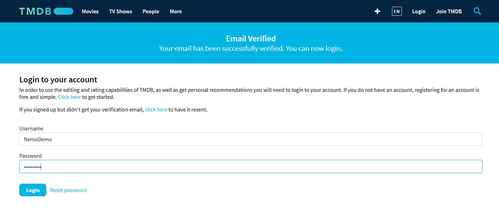
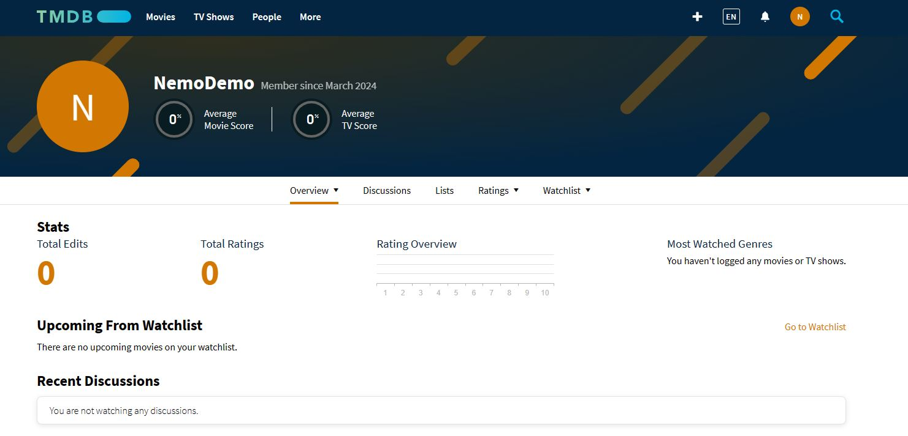
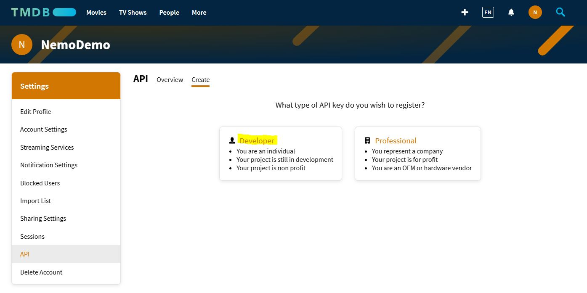

# Nýskráning á TMDB

### _The movie database_

Hér velur þú "Developer", lest síðan gaumgæfilega skilmálana og samþykkir þá.

Þá þarf að fylla út form og það er skynsamlegt að fylla út reitina með eftirfarandi hætti ásamt nafni ykkar og tölvupóstfangi.

Í vinsrti dálknum er hægt að velja alskonar gagnagrindur. Ef þú vilt skoða valda json gagnagrind t.d. Trending TV þá afritar þú urlið (í línu 3) úr kóðanum í hægri dálkinum og límir það í innsláttarreitinn í vafra ásamt  [**Api_key**](https://api.themoviedb.org/3/trending/tv/week?language=en-US&api_key=(ykkar_lykill))

Það er hægt að skoða json skrána á tmdb vefsíðunni ef þú velur API Key Auth og smellir á *Try It!* 

---
### [TMDB FAQ, Logo ofl](https://www.themoviedb.org/about/logos-attribution)
