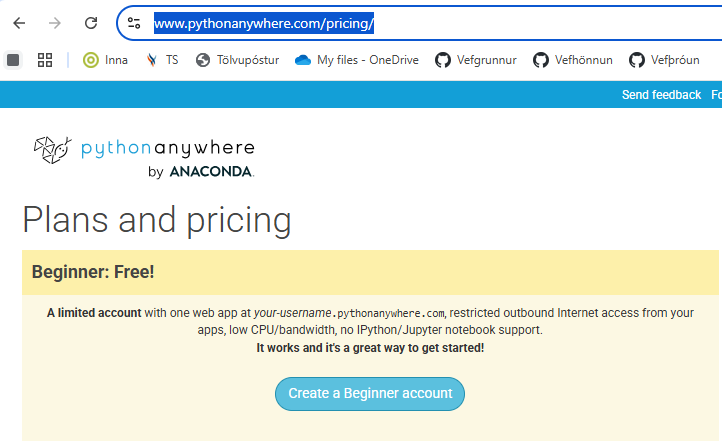

# How to Deploy a Flask App on PythonAnywhere

#### 1. Sign Up / Log In

Go to https://www.pythonanywhere.com/pricing/ and create a (free) account.

For further instructions 

- https://blog.pythonanywhere.com/121