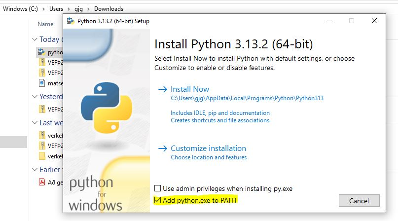
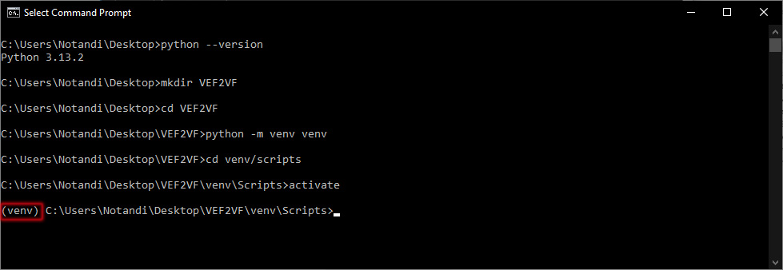
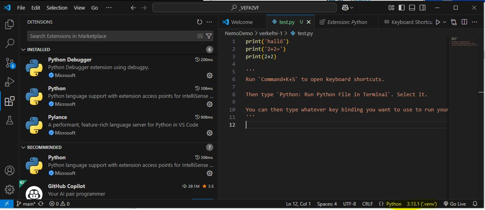
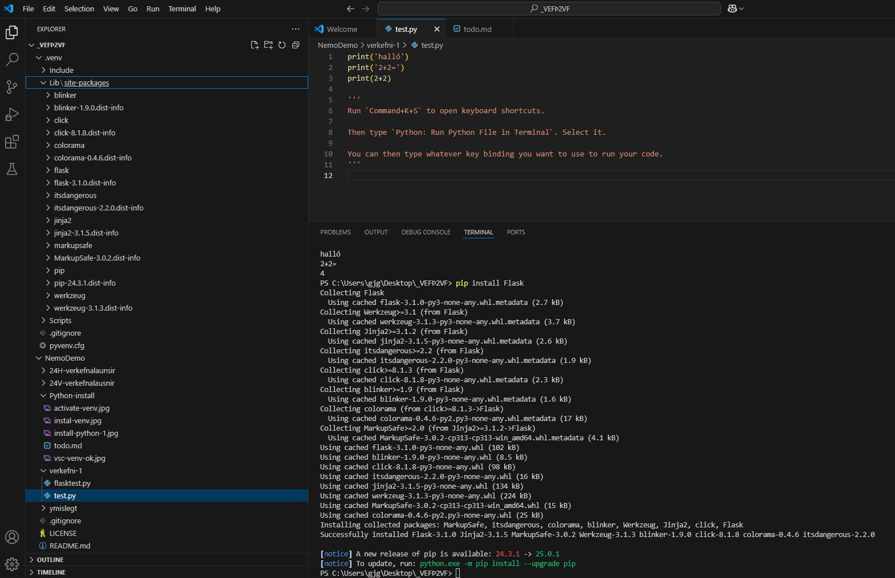
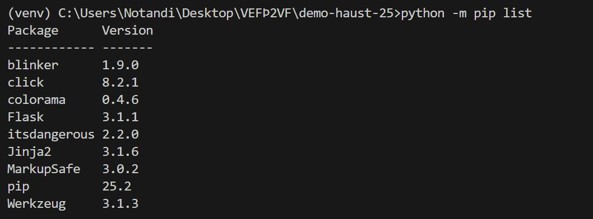

# How to build a Virtual Environment

1. install Python -> hakið við `PATH`
   * 

Veljið vinnusvæði (möppu) í _Terminal_ (Mac-Linux) eða _Command Prompt_ (PC) þar sem verkefni áfangans VEFÞ2VF verða unnin.

CLI dæmi ` cd ~/Desktop/ ` - ` mkdir VEFÞ2VF ` -` cd ~/Desktop/VEFÞ2VF/ `

## How to Install Flask on Linux, Windows, and macOS

- Step 1: Install Virtual Environment. 
  * PC Command Prompt: `python -m venv venv` 
  * Mac/Linux: `python3 -m venv venv`
- Step 2: Create an Environment. `cd venv\Scripts\`
- Step 3: Activate the Environment. `activate`
  * 
- Step 4: Í Visual Studio Code - bætið Python í Extension
  * Neðst í hægra horni forritsins á að sjást `Python 3.xx.x (venv)` <small>(x = útgáfan sem þú ert með á tölvunni þinni)</small>
  * 
- Step 5: In VSC, Python teminal, install Flask. `pip install Flask`
  * 
  * í Terminal er hægt að sjá hvort Flask pakkinn ('_module_') sé kominn í venv möppuna <br>
  

### Test the Development Environment

- Step 6: Setjið eftirfarandi kóða í py skjal

```python

from flask import Flask

app = Flask(__name__)

@app.route("/")
def home():
    return "<h1>Halló, Python - Flask er á porti 5000!</h1>"

if __name__ == '__main__':
  app.run(debug=True, use_reloader=True)  

```
- Step 7: Keyrið python skjalið (_run python file_)
- Step 8: Hægri smellið á 'http://127.0.0.1:5000' í _terminal_ og opnið vafra
  - 
  - 
